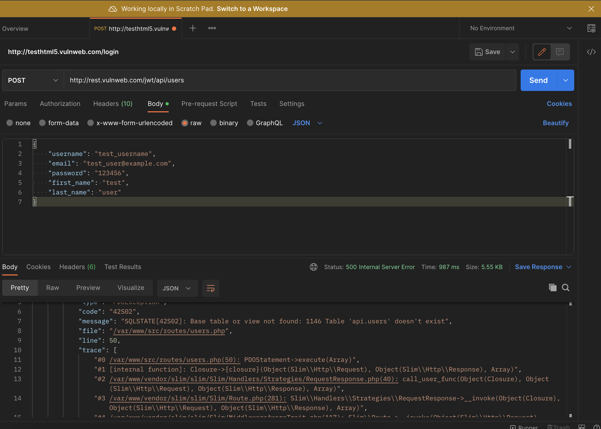

# pen-test


## XSS Vulnerability

- Test URL - http://testhtml5.vulnweb.com/

- Adding JS enclosed in tags to username filled when logging in executes the script on redirect.

Screen 1
<picture>
  
</picture>

Screen 2
<picture>
  
</picture>

Screen 3
<picture>
  
</picture>

### Prevention
 - Using a framework like React/Angular that'll automatically escape/encode the interpolated strings.
 - In an HTML context convert non-whitelisted values into HTML entities
 ```
 < to &lt;
 > to &gt;
 ```
 - In Javascript non-alphanumeric values should be Unicode-escaped
 ```
 < to \u003c
 > to \u003e
 ```
 - Whitelist tags if HTML user input is a business requirement.
 - PHP has a built-in function `htmlentities` to escape user input which can be used like this,
    ```
    <?php echo htmlentities($input, ENT_QUOTES, 'UTF-8');?>
    ```

## SQL Injection Vulnerability

- Test URL - http://rest.vulnweb.com/jwt/api/users

At the time  of testing `http://rest.vulnweb.com/jwt/api/users` returned the following response. Apparently someone has already dropped the users table.

<picture>
  
</picture>

- On little more digging around it was confirmed that the PHP server was not escaping query parameters before use in query

Compared to the screenshot above the injected query was executed successfully returning the not found response. If the SQL had public access the it can be logged into using username `test` and password `testpass`
<picture>
  
</picture>

### Prevention
- In PHP `PDO` and parameterization of queries can be used to prevent SQL injection.
- In languages like JS (Node) using an ORM (without raw queries) also protects against SQL injection.


## CORS

- Test URL - http://testhtml5.vulnweb.com/#/popular

<picture>
  
</picture>

- In the image above, a webpage injected with a script via XSS vulnerability can send a request to a third party url with a cookie that may have sensitive information.

- Trying to do the same from a secure site like MDN it's clear that it won't allow a random resource to be fetched from client side script

<picture>
  
</picture>

### Prevention
- Setting `Content-Security-Policy` header `default-src 'self';` in the HTML page response like so,
```
    <meta
      http-equiv="Content-Security-Policy"
      content="default-src 'self';"
    />
```
or in PHP code

```
<?php
	header("Content-Security-Policy: default-src 'self'");
?>
```
will only allow requests to the same domain+port from client side scripts.

- Modern browsers like Chrome and Firefox have strong protection against CORS. Unless the `Access-Control` headers are deliberately set to allow access to a resource the browser won't all cross origin requests from another website.


## HTTPOnly Cookie

- Test URL 1 - http://testphp.vulnweb.com/categories.php
- Test URL 2 - http://testhtml5.vulnweb.com/#/archive

Both the sites above set cookies with user info on Login.
<picture>
  
</picture>

<picture>
  
</picture>

- Cookies set this way can be read by client side scripts and be sent to a third party with an XHR request.

### Prevention
- Set the `HttpOnly` in server response headers in following format
```
Set-Cookie: `=“[; “=“]` `[; expires=“][; domain=“]` `[; path=“][; secure][; HttpOnly]`
```
- Optionally set the `SameSite=Strict` so that the browser only sends the cookie with requests from the cookie's origin site.

From MDN

- A cookie with the HttpOnly attribute is inaccessible to the JavaScript Document.cookie API; it's only sent to the server. For example, cookies that persist in server-side sessions don't need to be available to JavaScript and should have the HttpOnly attribute. This precaution helps mitigate cross-site scripting (XSS) attacks.

